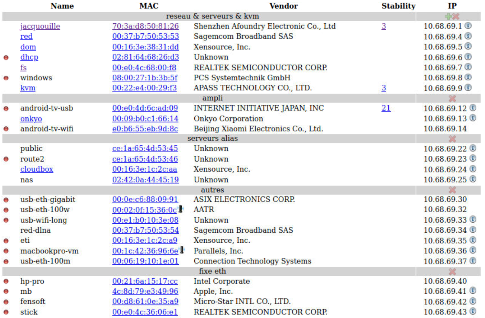
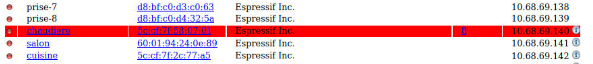
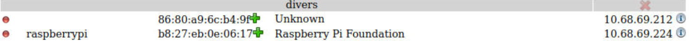
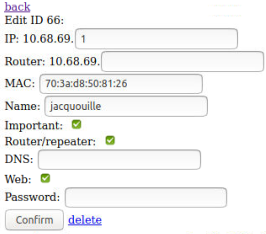
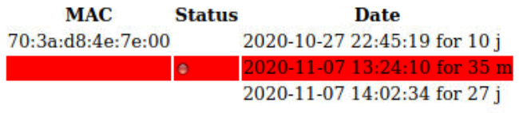
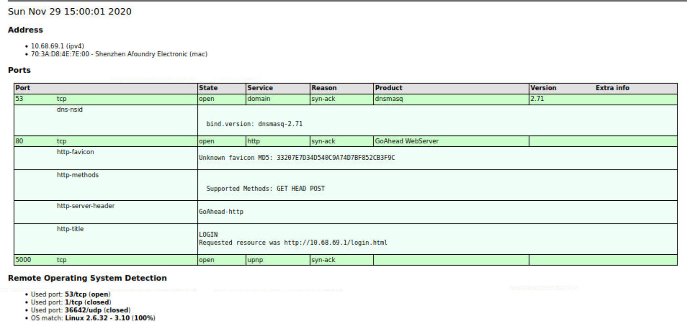

# What is it ?
A software to scan your network, add aliases and configure DHCP and DNS.

###Main page

With important machine down:

With unknown machines:


This page show you all devices.

- The + at the first line is to add a new pool of IP (range of IP with a description)
- Yellow means this machine is found in the arp cache (probably down few minutes ago)
- Blue means this machine is not replying to tcp ping but communicate with arp (probably some sleeping device like alexa or tablet)
- Red means this machine is down
- The name will be clickable if port 80 is open
- Clicking on the MAC will create or edit the dhcp/parameters
- Stability show the number of up/down within 24 hours
- The (i) icon will show you a deep nmap scan
- The + after a mac is to create a new static entry
- The small router icon is when a device is connected through another router

###New pool


###Editor


- Router is DHCP option router
- Name is DNS name
- Important will display an entry in red if it's down
- Router/repeater will consider this host as a router (if the mac of a target is this one, it will show a small router icon with router's name)
- DNS is DHCP dns option
- Web if port 80 is open, to show link in the main page

###History

Warning: a down will appear only if the down is more than 5 minutes

###Scanner

Show you a lot of information about the target

# Install
1. add this to ```/etc/dhcp/dhcpd.conf```:
```
include "/etc/dhcp/dhcpd.hosts";
```
2. add this to ```/etc/bind/named.conf.options```:
```
zone "lan" {
        type master;
        check-names ignore;
        file "/etc/bind/lan";
};
```
3. Add this to ```/etc/sudoers```
```
www-data ALL = NOPASSWD: /var/www/html/ips2hosts.sh
```
4. Edit config.php and import db.sql
5. Run php composer.phar install
6. Add this crontab:

```
    0    * * * * flock -n /tmp/ping.lck -c "/var/www/html/ping/network_inventory.sh"
    *    * * * * flock -n /tmp/ping.lck -c "/var/www/html/ping/ping.sh"
    *    * * * * flock -n /tmp/dhcp.lck -c "php /var/www/html/ping/dhcpd.leases.php"
```

or if you don't have flock:

```
    0    * * * * /var/www/html/ping/network_inventory.sh
    *    * * * * /var/www/html/ping/ping.sh
    *    * * * * php /var/www/html/ping/dhcpd.leases.php
```
