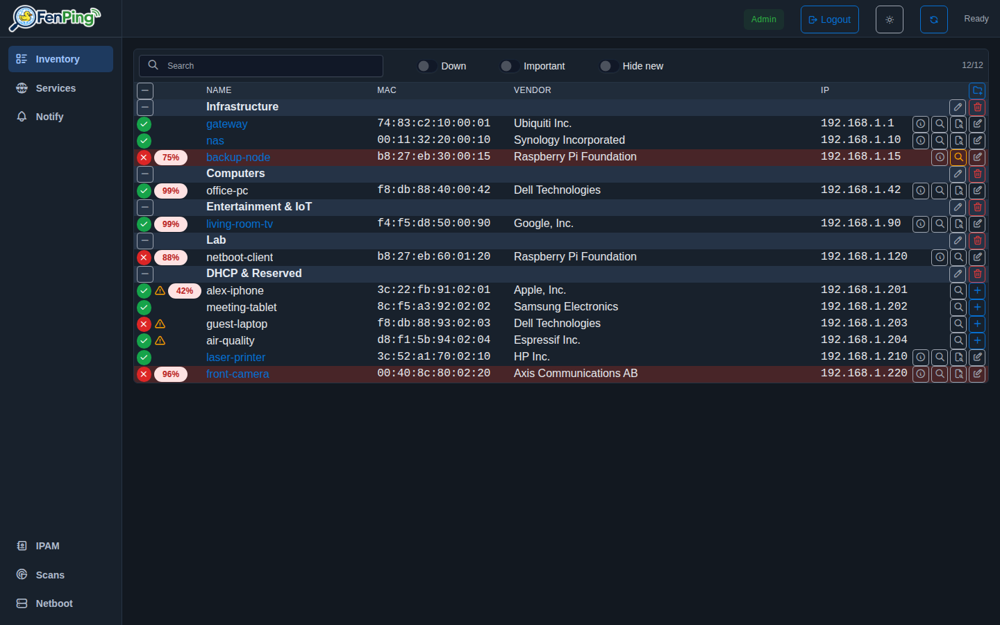
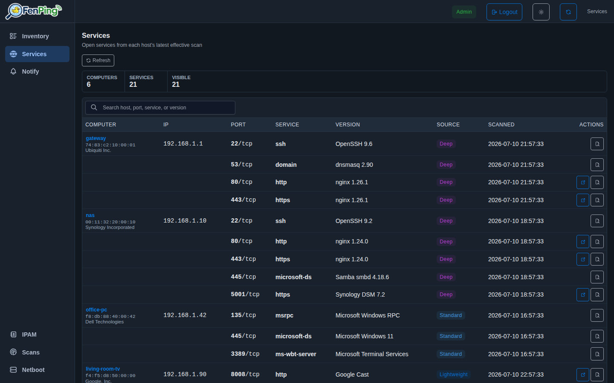
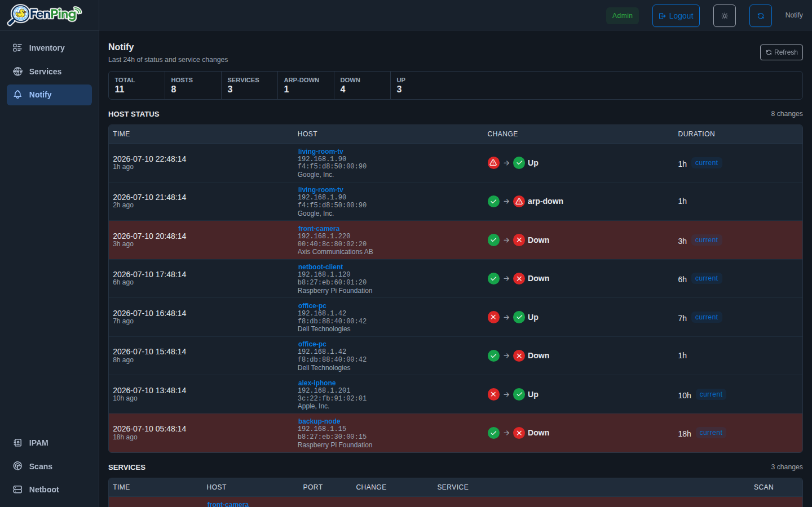
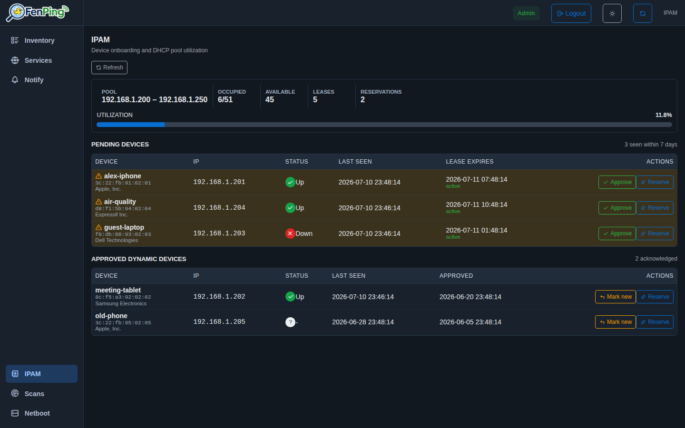
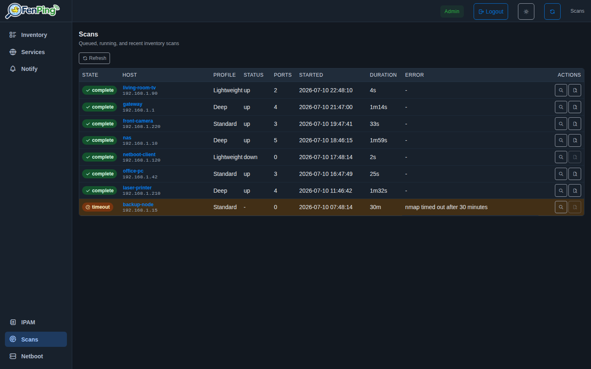
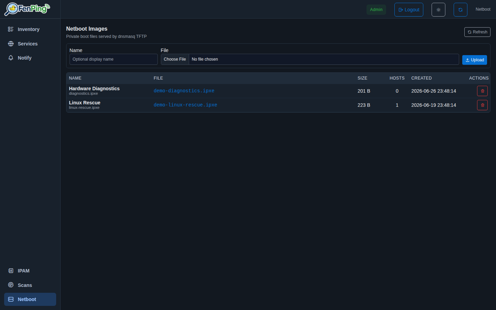
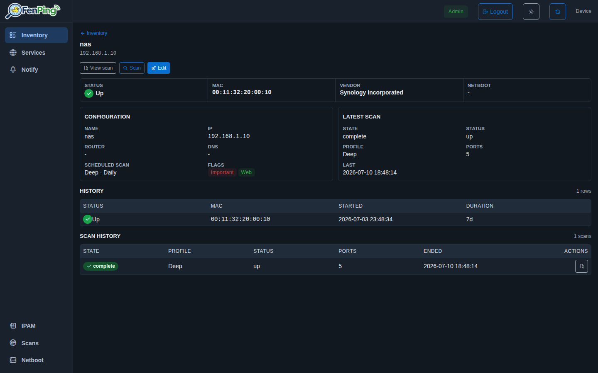
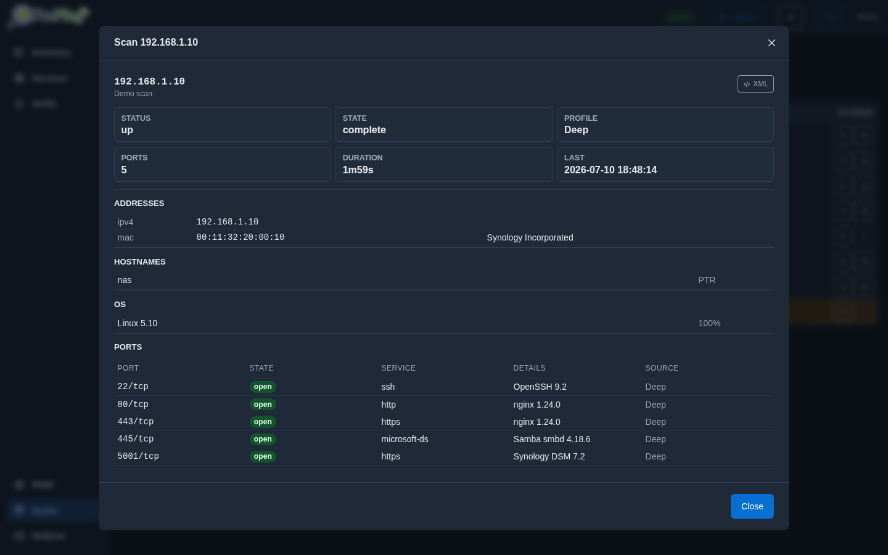

# FenPing

FenPing is a compact LAN appliance for device discovery, uptime history, DHCP/DNS host management, nmap scan history, notifications, backups, and netboot image assignment.

It uses a static Vue/Vite frontend with Vue Router, an nginx/PHP-FPM API and CLI backend, SQLite, dnsmasq, BusyBox cron, nmap, ping, ARP, and arping. Docker Compose runs the complete appliance in one container.

## Features

- Live inventory table for known and newly discovered devices.
- Persistent tri-state inventory filters for status, importance, and new-device state.
- Notes, location, owner, model, tags, curated icons, and scan cadence for managed hosts and named Docker containers, plus shared tag-based Inventory views.
- Status tracking with `Up`, `Down`, `arp`, and `arp-down` states.
- Stability, host history, and a 24-hour notify view.
- Static DHCP/DNS host management through dnsmasq.
- Named DNS override groups with hosts-file import, enable/disable controls, IPv4 records, and local CNAME aliases.
- Authenticated CSV and JSON exports for the selected network’s hosts, DHCP lease history, effective services, scan changes, and seven-day uptime intervals.
- Transactional DHCP lease history with stable first-seen and last-seen timestamps.
- Device onboarding with reversible MAC approval and DHCP pool utilization tracking.
- Transactional DHCP updates: host changes are validated and syntax-checked before the database and dnsmasq configuration are committed together.
- Category/range separators with collapsible groups and rename support.
- Lightweight, standard, and deep nmap profiles with deduplicated database history; partial results never replace the latest deep snapshot.
- Service-change notifications when an open port appears, disappears, or reports a different service/version.
- Optional daily and weekly Discord/Telegram summaries of outages, new devices, IP conflicts, changed ports, and expiring certificates observed by scans.
- Searchable service inventory showing every open service per computer from the latest deep or merged partial scan.
- Local MAC vendor resolution from the IEEE MA-L, MA-M, MA-S, and IAB registries, without sending device addresses to a third party.
- Netboot image upload, delete, and per-host boot image selection.
- Guest read-only mode and admin login.
- Abortable route loading, live running durations, and keyboard-accessible modal dialogs.
- Dark mode.
- Ten browser-interface languages—English, Simplified Chinese, Spanish, French, Arabic, Brazilian Portuguese, Indonesian, Japanese, Russian, and German—with a locally persisted Auto/manual selector, browser-language detection, and RTL support.
- Operations dashboard with exception-first health, capacity, queue, failure, readiness, and liveness reporting.
- Optional Discord webhook notifications.
- Backup and restore CLI for upgrades.

## Screenshots

### Inventory



### Services



### Notify



### IPAM



### Scans



### Netboot Images



### Host Detail



### Scan Details



## Runtime Layout

FenPing runs through Docker Compose with one container:

- `fenping` uses host networking and runs nginx/PHP-FPM, dnsmasq, BusyBox cron, nmap, ping/ARP tools, and the application CLI on Alpine Linux.

Application data is stored in the local SQLite database at `data/database/fenping.sqlite3`. `boot` applies the idempotent schema and verifies database integrity before nginx and PHP-FPM start.

## Install

1. Copy the environment template:

   ```bash
   cp env.template .env
   ```

2. Edit `.env` for your LAN and disable every existing DHCP server on that LAN.

3. Pull and start the published image:

   ```bash
   ./fenping.sh restart
   ```

4. Open FenPing:

   ```text
   http://<FENPING_IP>/
   ```

## Lifecycle Commands

`fenping.sh` is the single host-side entrypoint:

| Command | Purpose |
| --- | --- |
| `./fenping.sh` or `./fenping.sh restart` | Pull and deploy the configured published image. |
| `./fenping.sh start` | Start or recreate FenPing from the configured image already present locally, without pulling or creating an upgrade backup. |
| `./fenping.sh destroy` | Remove the FenPing Compose container while preserving persistent data and local images. |
| `./fenping.sh restore data/backups/<backup.tgz>` | Validate the archive path, remove the running FenPing container, and restore through a fresh one-off container. Persistent data remains restored but stopped afterward. |
| `./fenping.sh dev [--no-backup]` | Build the current platform as the local `dev` image and deploy it. `--no-backup` skips the pre-upgrade backup, restore verification, and rollback checkpoint. |
| `./fenping.sh dev restore data/backups/<backup.tgz>` | Build the current checkout as the local `dev` image, remove the running container, and restore with that image. |
| `./fenping.sh demo` | Rebuild and restore the synthetic screenshot environment. |
| `./fenping.sh rollback` | Restore the newest pre-upgrade checkpoint and its recorded image. |
| `./fenping.sh publish [version]` | Publish the three supported platforms; the version defaults to `FENPING_VERSION` or `1.8`. |

Set `PUBLISH_LATEST=0` when publishing if the shared `latest` tag must remain unchanged.

## Configuration

Important `.env` values:

| Variable | Description |
| --- | --- |
| `IP` | FenPing LAN address. |
| `IFACE` | Required host network interface that dnsmasq binds to for DHCP, DNS, and TFTP, for example `eth0`. |
| `FENPING_IMAGE` | Docker Hub repository pulled by `./fenping.sh restart`. Defaults to `fensoft/fenping`. |
| `FENPING_VERSION` | Published image tag pulled by `./fenping.sh restart`. Defaults to `1.8`. |
| `DOCKER_SOCKET` | Optional host Docker Unix socket. `fenping.sh` auto-detects `/var/run/docker.sock` when this is empty; set another local socket path to override it. |
| `DATABASE_PATH` | SQLite file inside the container. Defaults to `/var/lib/fenping/database/fenping.sqlite3`. |
| `DHCP_NETWORK` | Required canonical DHCP `/24`, for example `10.10.10.0/24`. dnsmasq, reservations, categories, and netboot assignments remain restricted to this network; IPAM displays it alongside every configured extra network. |
| `EXTRA_NETWORKS` | Optional comma-separated canonical `/24` networks available for scanning, for example `192.168.0.0/24,172.16.20.0/24`. FenPing reports whether an explicit route exists but never adds routes. |
| `INVENTORY_DOWN_RETENTION_DAYS` | Days to keep an unreserved host visible after it changes to Down. Defaults to `7`; reserved hosts remain visible. |
| `STATUS_HISTORY_RETENTION_DAYS` | Maximum age of status-history events. The daily cleanup defaults to `365` days. |
| `STATUS_HISTORY_MAX_EVENTS_PER_IP` | Maximum retained status-history events per IP. The daily cleanup keeps the newest `1000` events by default. Cleanup compacts SQLite when at least 16 MiB and 20% of the file are reclaimable. |
| `SCAN_GLOBAL_CONCURRENCY` | Maximum scans running across all networks. Defaults to `4`. |
| `SCAN_NETWORK_CONCURRENCY` | Default maximum scans running in one `/24`. Defaults to `2`. |
| `SCAN_NETWORK_DAILY_BUDGET` | Default scheduled-scan starts allowed per `/24` in a rolling 24 hours. Defaults to `254`; manual API and explicit CLI scans bypass this budget. |
| `SCAN_NETWORK_OVERRIDES` | Optional comma-separated `CIDR:concurrency:daily_budget` overrides, for example `192.168.1.0/24:1:64`. CIDRs must be canonical `/24` networks. |
| `DHCP_DEFAULT_ROUTER` | Optional router handed out by DHCP. Leave unset to suppress the DHCP router option. |
| `DHCP_DYNAMIC_BEGIN` | First dynamic DHCP address, last octet only. |
| `DHCP_DYNAMIC_END` | Last dynamic DHCP address, last octet only. |
| `PASSWORD` | Admin login password. Empty means a blank login password. |
| `SECRET` | Session signing secret. |
| `DISCORD_WEBHOOK_URL` | Discord activates when this webhook URL is set. |
| `DISCORD_MENTION` | Optional `@everyone` or Discord user ID (`123…`, `@123…`, or `<@123…>`). The mention is added to every Discord notification. |
| `TELEGRAM_BOT_TOKEN` | Telegram bot token. After setting it, send the bot a message and select the discovered destination from the Notifications page. |
| `HEALTH_FAILURE_WINDOW_HOURS`, `HEALTH_SCAN_QUEUE_MAX_AGE_MINUTES` | Recent failure window and queued-scan warning age. Defaults to `24` hours and `15` minutes. |
| `HEALTH_*_MAX_AGE_MINUTES`, `HEALTH_*_MAX_AGE_DAYS` | Freshness limits for ping, discovery, lease import, OUI data, and backups; see `env.template` for defaults. |
| `HEALTH_DISK_*_PERCENT`, `HEALTH_DHCP_*_PERCENT` | Warning and critical utilization thresholds for disk and the DHCP pool. Defaults to `80` and `90` percent. |

Discord and Telegram use the same persisted delivery rules. The Notifications modal controls restarts, IP conflicts, separate Normal/Important host-status and service-change switches, and daily or weekly reports at a selected UTC hour. Scheduled summaries cover the preceding one or seven days and include certificate expiry from retained `ssl-cert` scan observations. Telegram chat destinations are discovered through the Bot API's `getUpdates` method and selected in that modal; only authenticated administrators can retrieve chat/user details. The bot token and Discord settings remain environment-only, and Telegram destination IDs, bot fingerprints, and discovered user metadata are excluded from backups.

Managed hosts require a valid IPv4 address and six-octet MAC address. Host names are optional; when set, they must contain one DNS label using letters, numbers, and internal hyphens. Per-host DNS overrides accept one or more IPv4 addresses separated by spaces, commas, or semicolons.

The **DNS** page manages override groups separately from DHCP reservations. Each group is editable as plain text and can be enabled or disabled as a unit. Blank lines and comments beginning with `#` are ignored. IPv4 records use hosts-file syntax, and aliases use an explicit CNAME form:

```text
# One address can own one or more names
192.168.1.20 printer.example.test printer

# The target must be a local FenPing or enabled custom record
CNAME print.example.test printer.example.test
```

Enabled groups are compiled into dnsmasq configuration and syntax-tested inside the same database/configuration transaction used by DHCP mutations. A custom record replaces the generated FenPing record for the same name instead of adding a second address. Dnsmasq cannot point a local CNAME directly at a target learned only from an upstream resolver, so FenPing rejects such targets rather than allowing a silently ignored alias.

## Startup Doctor

Before SQLite or any daemon starts, FenPing checks the selected interface and `/24`, verifies that a configured router is on-link and answers ARP, validates the dynamic pool, tests the DNS/DHCP/TFTP/HTTP sockets, exercises persistent-directory and SQLite WAL writes, and broadcasts a DHCP discovery request. When `DHCP_DEFAULT_ROUTER` is omitted, the router reachability check passes as not configured and dnsmasq suppresses the DHCP router option. The complete check runs on every startup. Any failed check—including any DHCP offer from another server—blocks nginx, PHP-FPM, cron, and authoritative dnsmasq startup; there is no bypass for a competing DHCP server.

`./fenping.sh restart` stops a failed replacement's restart loop and prints its doctor report. To run the same pre-start check manually, stop the service and use a one-off host-networked container:

```bash
docker compose stop app
docker compose run --rm --no-deps app php /opt/fenping/cli.php doctor
docker compose run --rm --no-deps app php /opt/fenping/cli.php doctor --json
```

If `IP` is not set in `.env`, pass the interface address with `-e IP=<FenPing IPv4>` because the one-off command does not run boot's automatic address discovery.

Authenticated administrators can open **Operations** in the sidebar. The page leads with new devices, important hosts down, failed or timed-out scans, and overdue backups, then shows queue, job freshness, SQLite/disk, DHCP capacity, service, dnsmasq-generation, and notification-delivery health. The existing privileged Doctor diagnostic and remediation report remains on the same page. It is also available through `GET /api/doctor` and `docker exec fenping php /opt/fenping/cli.php doctor --runtime --json`; the API can invoke only that exact root CLI command through `doas`.

The DHCP probe uses Nmap's fixed discovery MAC and waits up to five seconds, so it does not request a lease or exhaust the pool.

Scheduled ping and discovery jobs independently rotate through one configured network per invocation. Inventory exposes a browser-persisted network selector and labels networks without an explicit route as “Not routed” without disabling them. Existing category ranges are displayed on extra networks, while devices and categories there remain read-only.

When a local Docker socket is available, FenPing adds the occupied IPv4 `/24` slices from Docker networks to the manual `EXTRA_NETWORKS` list. Docker network events refresh this runtime-only cache within seconds; startup, hourly, and sidebar Refresh actions perform full reconciliation. Broader Docker subnets contribute only `/24` slices containing a gateway or attached container, while IPv6 and subnets narrower than `/24` are ignored. Guest Refresh reloads network data without running a ping scan; authenticated Inventory Refresh also runs the existing ping operation.

The Compose bind is marked read-only, which prevents replacement through the mount but does **not** make the Docker API read-only. Access to `docker.sock` is effectively host-level Docker control. FenPing exposes only a parameterless refresh route backed by an exact `doas` command, but mount the socket only when this trust is acceptable.

## Publishing Images

Log in to Docker Hub, then publish the versioned multi-architecture image:

```bash
docker login
./fenping.sh publish 1.8
```

The targets are exactly `linux/arm64`, `linux/amd64`, and `linux/arm/v7`. The script automatically runs `tonistiigi/binfmt --install all`, so publishing requires permission to start a privileged Docker container. Set `PUBLISH_LATEST=0` to omit the `latest` tag, or set `FENPING_IMAGE` to publish another Docker Hub repository. The script uses a reusable `fenping-multiarch` Buildx container builder, pushes the version and `latest` manifests, attaches provenance and an SBOM, and inspects the published result.

By default, `./fenping.sh restart` never builds the application image. It pulls `FENPING_IMAGE:FENPING_VERSION` before stopping the current app, so a missing or inaccessible tag leaves the running deployment untouched.

To build the current checkout for the Docker host's platform, tag it as `FENPING_IMAGE:dev`, and restart with that local image:

```bash
./fenping.sh dev
```

Development mode builds before stopping the running app and prevents Compose from pulling over the local `dev` tag. A later `./fenping.sh restart` returns to the version configured by `FENPING_VERSION` in `.env`.

## Persistent Data

Do not delete `data/` casually. It is the appliance state.

| Host path | Container path | Purpose |
| --- | --- | --- |
| `data/database` | `/var/lib/fenping/database` | SQLite database and WAL files. |
| `data/dnsmasq` | `/var/lib/misc` | dnsmasq leases. |
| `data/dnsmasq.d` | `/etc/dnsmasq.d` | Generated dnsmasq config files. |
| `data/netboot` | `/var/lib/fenping/netboot` | Uploaded netboot files. |
| `data/backups` | `/var/lib/fenping/backups` | Backup archives and imported dumps. |
| `data/state` | `/var/lib/fenping/state` | Refreshed IEEE vendor registry and optional state/health files. |

When Docker or a root-run launcher creates `data/database` as root, startup assigns that mount to the image's unprivileged `www-data` worker and restricts directories to mode `2770` and files to `0660`. Existing database contents are not rewritten, and symlinks and nested mounts are not traversed. A database mount already owned by a non-root host user keeps its non-root entries and modes; any residual root-owned entries are repaired to that host identity, and the container maps its application worker to the same numeric owner and group.

nginx serves only `/var/www/public`, which contains the built frontend and the small API entrypoint. PHP application code lives in `/opt/fenping`; runtime files under `/var/lib/fenping` are not directly web-accessible. nginx explicitly rejects dotfiles, private extensions, and legacy runtime paths, while netboot files can only be downloaded through the validated API route.

### SSD write endurance

SQLite uses WAL mode with `synchronous=NORMAL`, a 30-second busy timeout, foreign-key enforcement, and memory-backed temporary tables. This keeps the database consistent while reducing per-transaction sync writes; an operating-system crash or power loss may lose the most recent committed transactions. DHCP leases, scans, and application data remain persistent.

Routine writes are also limited with memory-backed `/tmp` and `/run` for scan temporaries, nginx upload buffering, locks, PHP sessions, and lease-import staging; nginx access logging and verbose DHCP logging are disabled; Docker logs are compressed and rotated; unchanged dnsmasq files are not replaced; lease imports upsert observed rows instead of rebuilding the table; stable ping-history rows are extended at most once per day; and an unchanged IEEE registry is not rewritten into SQLite at boot. Login sessions are intentionally cleared when the app container restarts because their files live in `/run`.

## CLI

Run operational commands from the container:

```bash
docker exec fenping php /opt/fenping/cli.php ping
docker exec fenping php /opt/fenping/cli.php database
docker exec fenping php /opt/fenping/cli.php ping 10
docker exec fenping php /opt/fenping/cli.php hosts
docker exec fenping php /opt/fenping/cli.php inventory
docker exec fenping php /opt/fenping/cli.php inventory --profile lightweight 10.10.10.10
docker exec fenping php /opt/fenping/cli.php inventory --profile standard 10.10.10.10
docker exec fenping php /opt/fenping/cli.php inventory --profile deep 10.10.10.10
docker exec fenping php /opt/fenping/cli.php inventory --work
docker exec fenping php /opt/fenping/cli.php scan-port-backfill
docker exec fenping php /opt/fenping/cli.php status-clean [retention-days] [max-events-per-ip]
docker exec fenping php /opt/fenping/cli.php oui-refresh
docker exec fenping php /opt/fenping/cli.php oui-sync
docker exec fenping php /opt/fenping/cli.php backup
docker exec fenping php /opt/fenping/cli.php backup-verify /var/lib/fenping/backups/fenping-YYYYmmdd-HHMMSS.tgz
docker exec fenping php /opt/fenping/cli.php backup-maintenance verify
docker exec fenping php /opt/fenping/cli.php notify-restart
docker exec fenping php /opt/fenping/cli.php restore /var/lib/fenping/backups/fenping-YYYYmmdd-HHMMSS.tgz
docker exec fenping php /opt/fenping/cli.php discord-restart
```

Cron inside the container runs:

- `ping` every 15 minutes.
- inventory discovery every hour; discovered hosts are queued only when their scan cadence is due.
- the inventory worker enforces global and per-network concurrency plus each network's rolling scheduled-scan budget.
- the local IEEE OUI registry is refreshed monthly on the first day at 03:17.
- dnsmasq lease import every minute.
- status-history cleanup every day at 05:07 UTC.
- a verified managed backup every day at 02:23 UTC.
- a round-robin restore test of retained backups every Sunday at 04:41 UTC.

The image does not embed a vendor registry. At startup, and again through a monthly background job, FenPing downloads and validates the complete public MA-L, MA-M, MA-S, and historical IAB CSV files from the [IEEE Registration Authority public listings](https://standards.ieee.org/products-programs/regauth/). A successful refresh atomically replaces `data/state/ieee-oui.json` and transactionally updates the SQL table only when assignments changed. Inventory requests query this local prefix index; individual LAN MAC addresses are never sent outside the appliance. If a later download or SQL import fails, FenPing retains the previous registry and SQL data.

Completed nmap output is stored in SQLite. FenPing keeps one XML snapshot per distinct semantic result and scan profile, so unchanged scans reuse the existing snapshot. Lightweight checks Nmap's 100 most common TCP ports with a five-minute limit. Standard checks the top 1,000 TCP ports with service, OS, default-script, and traceroute detection with a 30-minute limit. Deep performs the same detection across all 65,535 TCP ports with a two-hour limit. The normal detail view prefers the latest deep result. Selecting a lightweight or standard result merges it over the preceding deep snapshot: partial observations replace matching ports while deep-only ports and OS data remain visible with source labels. Existing `quick` history remains readable as Lightweight. OS detection shows every 100% match, or only the highest-accuracy match when nmap has no 100% result.

While nmap runs, FenPing parses `--stats-every 5s` timing output into monotonic approximate progress and stable phases. Scans, Inventory, and Host Detail expose progress, queue position or waiting reason, and authenticated cancellation. Queued cancellation is immediate; running cancellation requests TERM and escalates to KILL after ten seconds if necessary. Guests can see progress but cannot cancel work.

Completed scans also build an effective open-port view. A deep scan observes the full TCP range; lightweight and standard scans change only the ports listed in their Nmap scan scope. Services in the first usable result are recorded as newly appeared, and later appearances, disappearances, and confirmed service/version changes are stored for seven days, displayed on Notify, and sent to Discord when a webhook is configured. Missing version data from a partial scan does not erase version details learned by a deeper scan.

Managed hosts have an automatic scan profile and cadence. New managed hosts default to a Standard scan every 24 hours; existing hosts retain their configured profile and cadence. Set the cadence to `0` in the host editor to disable scheduled scans, or enter any interval up to 8,760 hours. The hourly discovery job queues a host only when its latest successful scan using the selected profile is older than that interval. Manual scans and explicit CLI targets ignore cadence. Unmanaged discovered devices receive a Lightweight scan every 24 hours. Their first automatic scans are assigned deterministic UTC hours so discovering a populated LAN does not enqueue every device at once. Deep scans remain available manually or through an explicit per-host schedule.

At boot, `scan-port-backfill` replays stored snapshots in chronological order and inserts any missing service-change events using their original scan timestamps. The replay is idempotent, so it can also be run manually after restoring older scan history.

## Backup And Restore

### Upgrading from MariaDB

SQLite starts with a fresh database and does not automatically import `data/db`. The old MariaDB directory is left in place for rollback but is no longer mounted. To preserve an older installation manually, create a version 1.6 FenPing archive before upgrading and restore that archive after the SQLite deployment starts.

### Screenshot demo

The versioned `demo/` source contains a synthetic network with inventory, IPAM, history, notifications, services, scans, and netboot examples. To rebuild its backup, preserve the current state, and restore the demo:

```bash
./fenping.sh demo
```

The generated archive is `data/backups/fenping-demo.tgz`. Before restoring it, the command creates a timestamped `data/backups/fenping-before-demo-*.tgz` containing the current database and netboot files. Demo timestamps shift to the restore time so recent activity remains suitable for screenshots.

Normal, development, and demo restarts create a pre-upgrade archive while the old container is still running. The archive is checksum-validated and fully restored into temporary database and netboot paths with the exact target image before the old container is stopped. The previous image ID, repository digest, local rollback tag, archive checksum, and outcome are journaled under data/state/upgrades.

For a faster disposable development cycle, `./fenping.sh dev --no-backup` skips the archive, restore verification, rollback image tag, and upgrade journal. If that replacement fails, `./fenping.sh rollback` cannot restore the skipped development restart.

If the replacement fails its health check, it remains available for inspection. Run `./fenping.sh rollback` to restore the newest checkpoint. Rollback first creates and verifies a rescue archive of the post-upgrade state, then restores the pre-upgrade archive with the recorded previous image. The configured image in `.env` is not changed.

Managed backups retain seven daily recovery points, four ISO-week recovery points, and two pre-upgrade checkpoints. Manual, imported, demo, and rollback-rescue archives are never pruned. Verification status and authenticated downloads are available on the Backups page.

By default data/backups and data/database are on the same filesystem, so FenPing shows a warning. Mount data/backups on separate storage or regularly download/copy archives to another device; FenPing cannot detect copies stored outside the appliance.

Create a full backup archive before upgrades:

```bash
docker exec fenping php /opt/fenping/cli.php backup
```

Restore from a FenPing archive:

```bash
docker exec fenping php /opt/fenping/cli.php restore /var/lib/fenping/backups/fenping-YYYYmmdd-HHMMSS.tgz
```

Backups use the database-neutral version 1.6 JSON format (`db.json` inside the archive). Existing version 1.6 archives created by MariaDB-based FenPing releases remain restorable into SQLite. SQL-based backups from earlier versions are not supported.

Legacy 1.2 SQL and nmap backups can be converted offline, without a MariaDB/MySQL server. The nmap archive must contain one latest result per host named `IP.xml`:

```bash
python3 tools/convert-v1.2-backup.py legacy.sql.tgz legacy.nmap.tgz
```

The converter parses mysqldump and nmap XML data directly, migrates legacy leases to the current shape, marks valid dynamic devices observed in legacy leases or ping state as approved, preserves `ips` hosts as DHCP reservations, decodes HTML entities used by 1.2 category names, imports each XML file as the host's latest deep scan, and creates a restore-compatible archive with an empty netboot directory. The output defaults to the SQL filename without `.sql` (for example, `legacy.tgz`). Use `--target converted.tgz` to select another destination and `--force` to replace an existing target.

## Admin Workflow

The UI starts in guest mode. Guests can view inventory, IPAM utilization, services, history, scans, health, and notifications, but cannot approve devices or change DHCP/DNS/netboot state.

After login, admins can create/edit hosts, edit metadata for discovered Docker devices with a verified network/container identity, manage shared tag views, add/rename/delete categories, trigger ping refreshes and choose lightweight, standard, or deep host scans, upload/delete netboot images, and assign netboot images to hosts.

Netboot uploads accept UEFI applications (`.efi`), iPXE/PXE loaders (`.kpxe`, `.kkpxe`, `.kkkpxe`, `.pxe`, `.lkrn`), PXELINUX loaders (`.0`), and iPXE scripts (`.ipxe`). FenPing validates both the filename extension and the file content. PHP execution is disabled in the netboot directory.

## API

The PHP API enters through the thin `api.php` wrapper and is dispatched by the typed kernel and route objects under `src/Api/`.

Useful endpoints:

| Method | Route | Description |
| --- | --- | --- |
| `GET` | `/api/health` | Appliance health. |
| `GET` | `/api/health/live` | Process liveness; succeeds while the PHP application can answer. |
| `GET` | `/api/health/ready` | Traffic readiness; returns HTTP `503` until SQLite, dnsmasq, cron, and integrity status are ready. |
| `GET` | `/api/doctor` | Admin-only live network, storage, service-listener, and competing-DHCP diagnostics. |
| `GET` | `/api/inventory` | Network inventory with host metadata, available tags, and shared saved filters. |
| `PUT` | `/api/inventory/device-metadata` | Admin-only metadata and scan-schedule update for a currently verified Docker network/container identity. |
| `POST` | `/api/inventory/saved-filters` | Admin-only creation of an appliance-wide tag view. |
| `PUT` | `/api/inventory/saved-filters/{id}` | Admin-only rename or tag replacement for a saved view. |
| `DELETE` | `/api/inventory/saved-filters/{id}` | Admin-only deletion of a saved view. |
| `GET` | `/api/ipam` | All configured subnets, their pending and approved dynamic devices, active conflicts, and DHCP pool utilization. |
| `PUT` | `/api/ipam/devices/{mac}/approval` | Acknowledge a new device without changing DHCP behavior. |
| `DELETE` | `/api/ipam/devices/{mac}/approval` | Mark an acknowledged dynamic device as new again. |
| `PUT` | `/api/notify/delivery` | Admin-only replacement of shared event rules, scheduled-report settings, and, when supplied, the selected discovered Telegram chat. |
| `GET` | `/api/notify/telegram/chats` | Admin-only refresh and listing of Telegram chats discovered through `getUpdates`. |
| `GET` | `/api/exports/{dataset}` | Admin-only CSV/JSON download for `hosts`, `leases`, `services`, `scan_changes`, or `uptime_history`, scoped by the configured `network` query parameter. |
| `GET` | `/api/notify` | Last 24 hours of changes. |
| `GET` | `/api/services` | Current open services by host using the latest effective scan. |
| `POST` | `/api/ping/refresh` | Run ping scan and wait for completion. |
| `GET` | `/api/history/{ip}` | Status history for a host. |
| `GET` | `/api/hosts/by-ip/{ip}/detail` | Combined identity, status history, and scan details for an inventory device. |
| `GET` | `/api/scans` | Recent and active scans plus global and per-network concurrency/budget usage. |
| `GET` | `/api/scans/{ip}` | Preferred scan result as JSON, favoring the latest deep result. |
| `GET` | `/api/scans/profiles` | List available scan profiles and timeout limits. |
| `POST` | `/api/scans/{ip}` | Queue the requested `lightweight`, `standard`, or `deep` profile and return HTTP `202`. |
| `POST` | `/api/scans/{ip}/{id}/cancel` | Admin-only queued or running cancellation. Running requests return HTTP `202` until termination is confirmed. |
| `GET` | `/api/scans/{ip}/xml` | Compatibility XML generated from the normalized scan tables. |
| `POST` | `/api/scans/{ip}/quick` | Legacy alias that queues a lightweight scan. |
| `GET` | `/api/netboot/images` | List netboot images. |
| `POST` | `/api/netboot/images` | Upload a netboot image. |
| `GET` | `/api/netboot/images/{id}/file` | Download a netboot image. |
| `DELETE` | `/api/netboot/images/{id}` | Delete a netboot image. |
| `GET` | `/api/backups` | Admin-only backup list and verification status. |
| `POST` | `/api/backups` | Admin-only creation of a manual backup. |
| `GET` | `/api/backups/{filename}/file` | Admin-only backup download. |
| `POST` | `/api/backups/{filename}/restore` | Admin-only verified restore after creating a safety backup of current state. |

Errors return JSON:

```json
{ "error": "message" }
```

## Checks

Install the Chromium browser used by the frontend suite once per development environment:

```bash
npx playwright install chromium
```

Useful checks before committing:

```bash
bash -n boot fenping.sh tests/test.sh
docker compose config --quiet
docker build --check .
docker build -t fenping-check .
npm test
npm run test:browser
npm run build
composer validate --strict
composer dump-autoload --optimize --strict-psr
composer test
find src tests/Php -name '*.php' -type f -print0 | xargs -0 -n1 php -l
docker build --target backend-test -t fenping-backend-test .
docker build --target frontend-test -t fenping-frontend-test .
```

Smoke test a running instance:

```bash
SITE=http://<FENPING_IP> PASS=<admin-password> ./tests/test.sh
```

## Troubleshooting

### Health Is Degraded

```bash
curl -fsS http://127.0.0.1/api/health
docker logs --tail=100 fenping
```

### Startup Doctor Fails

Read the complete report and correct every `FAIL` before retrying. In particular, disable the router's DHCP service before allowing FenPing to become authoritative:

```bash
docker logs --tail=100 fenping
docker compose run --rm --no-deps app php /opt/fenping/cli.php doctor
```

### dnsmasq Does Not Update

```bash
docker exec fenping php /opt/fenping/cli.php hosts
docker logs -f fenping
```

### Scans Are Missing

```bash
docker exec fenping php /opt/fenping/cli.php inventory --profile lightweight 10.10.10.10
docker exec fenping php /opt/fenping/cli.php inventory --work
```

### Multi-architecture Build Is Slow During npm install

The Dockerfile uses an npm cache mount and conservative retry settings. Build and push through the release script so Buildx can reuse its container cache:

```bash
./fenping.sh publish 1.8
```
