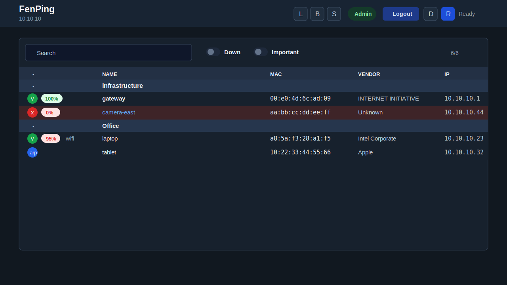
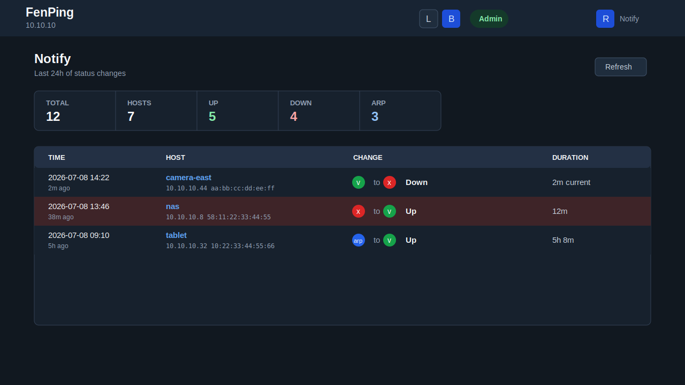
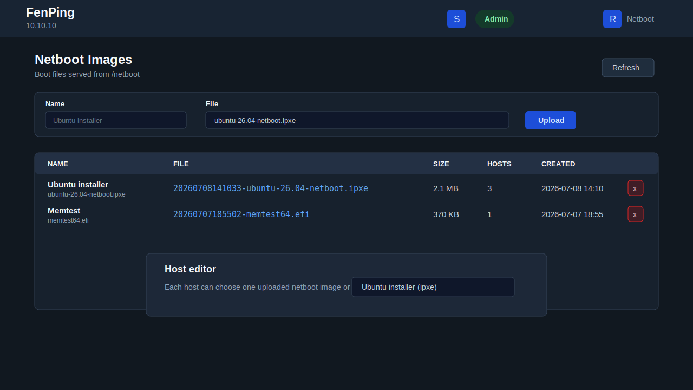
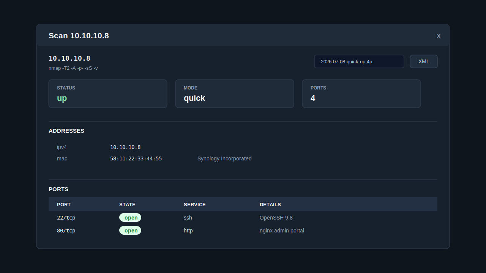

# FenPing

FenPing is a compact LAN appliance for device discovery, uptime history, DHCP/DNS host management, nmap scan history, notifications, backups, and netboot image assignment.

It uses a static Vue/Vite frontend, a PHP API/CLI backend, MariaDB, dnsmasq, cron, nmap, ping, ARP, and arping. The default runtime is one Docker container.

## Features

- Live inventory table for known and newly discovered devices.
- Status tracking with `Up`, `Down`, `arp`, and `arp-down` states.
- Stability, host history, and a 24-hour notify view.
- Static DHCP/DNS host management through dnsmasq.
- Category/range separators with collapsible groups and rename support.
- Quick and deep nmap scans with XML history.
- Netboot image upload, delete, and per-host boot image selection.
- Guest read-only mode and admin login.
- Dark mode.
- `/api/health` appliance status endpoint.
- Optional Discord webhook notifications.
- Backup and restore CLI for upgrades.

## Screenshots

### Inventory



### Notify



### Netboot Images



### Scan Details



## Runtime Layout

FenPing currently runs as one host-networked container named `fenping`.

Inside that container:

- Apache serves the static Vue app and routes `/api/...` to PHP.
- MariaDB stores inventory, ping, stats, scan, category, auth, and netboot metadata.
- dnsmasq serves DHCP, DNS, leases, and TFTP/netboot settings.
- cron runs ping scans, inventory scans, and lease imports.
- PHP CLI commands handle host generation, scanning, backup/restore, and notifications.

This intentionally is not a split Compose deployment.

## Install

1. Copy the environment template:

   ```bash
   cp env.template .env
   ```

2. Edit `.env` for your LAN.

3. Build and start:

   ```bash
   ./restart.sh
   ```

4. Open FenPing:

   ```text
   http://<FENPING_IP>/
   ```

## Configuration

Important `.env` values:

| Variable | Description |
| --- | --- |
| `IP` | FenPing LAN address. |
| `IFACE` | Required host network interface that dnsmasq binds to for DHCP, DNS, and TFTP, for example `eth0`. |
| `NETWORK` | `/24` prefix, for example `10.10.10`. |
| `DHCP_DEFAULT_ROUTER` | Router handed out by DHCP. |
| `DHCP_DYNAMIC_BEGIN` | First dynamic DHCP address, last octet only. |
| `DHCP_DYNAMIC_END` | Last dynamic DHCP address, last octet only. |
| `PASSWORD` | Admin login password. Empty means a blank login password. |
| `SECRET` | Session signing secret. |
| `DISCORD_WEBHOOK_URL` | Optional Discord webhook for status and restart notifications. |

## Persistent Data

Do not delete `data/` casually. It is the appliance state.

| Host path | Container path | Purpose |
| --- | --- | --- |
| `data/db` | `/var/lib/mysql` | MariaDB data. |
| `data/dnsmasq` | `/var/lib/misc` | dnsmasq leases. |
| `data/dnsmasq.d` | `/etc/dnsmasq.d` | Generated dnsmasq config files. |
| `data/nmap` | `/var/lib/fenping/nmap` | nmap XML, metadata, and history. |
| `data/netboot` | `/var/lib/fenping/netboot` | Uploaded netboot files. |
| `data/backups` | `/var/lib/fenping/backups` | Backup archives and imported dumps. |
| `data/state` | `/var/lib/fenping/state` | Optional state/health files. |

Apache serves only `/var/www/public`, which contains the built frontend and the small API entrypoint. PHP application code lives in `/opt/fenping`; runtime files under `/var/lib/fenping` are not directly web-accessible.

## CLI

Run operational commands from the container:

```bash
docker exec fenping php /opt/fenping/cli.php ping
docker exec fenping php /opt/fenping/cli.php ping 10
docker exec fenping php /opt/fenping/cli.php hosts
docker exec fenping php /opt/fenping/cli.php inventory
docker exec fenping php /opt/fenping/cli.php inventory --quick 10.10.10.10
docker exec fenping php /opt/fenping/cli.php inventory --work
docker exec fenping php /opt/fenping/cli.php backup
docker exec fenping php /opt/fenping/cli.php restore /var/lib/fenping/backups/fenping-YYYYmmdd-HHMMSS.tgz
docker exec fenping php /opt/fenping/cli.php discord-restart
```

Cron inside the container runs:

- `ping` every 15 minutes.
- inventory discovery every hour; discovered hosts are queued for deep scans.
- the inventory worker runs queued scans with a maximum concurrency of four.
- dnsmasq lease import every minute.

## Backup And Restore

Create a full backup archive before upgrades:

```bash
docker exec fenping php /opt/fenping/cli.php backup
```

Restore from a FenPing archive:

```bash
docker exec fenping php /opt/fenping/cli.php restore /var/lib/fenping/backups/fenping-YYYYmmdd-HHMMSS.tgz
```

Restore from a raw SQL dump:

```bash
docker exec fenping php /opt/fenping/cli.php restore /var/lib/fenping/backups/db.sql.gz
```

## Admin Workflow

The UI starts in guest mode. Guests can view inventory, history, scans, health, and notifications, but cannot change DHCP/DNS/netboot state.

After login, admins can create/edit hosts, add/rename/delete categories, trigger ping refreshes and quick scans, upload/delete netboot images, and assign netboot images to hosts.

Netboot uploads accept UEFI applications (`.efi`), iPXE/PXE loaders (`.kpxe`, `.kkpxe`, `.kkkpxe`, `.pxe`, `.lkrn`), PXELINUX loaders (`.0`), and iPXE scripts (`.ipxe`). FenPing validates both the filename extension and the file content. PHP execution is disabled in the netboot directory.

## API

The PHP API is routed by `api.php` and grouped under `routes/`.

Useful endpoints:

| Method | Route | Description |
| --- | --- | --- |
| `GET` | `/api/health` | Appliance health. |
| `GET` | `/api/inventory` | Network inventory. |
| `GET` | `/api/notify` | Last 24 hours of changes. |
| `POST` | `/api/ping/refresh` | Run ping scan and wait for completion. |
| `GET` | `/api/history/{ip}` | Status history for a host. |
| `GET` | `/api/scans/{ip}` | Latest scan as JSON. |
| `GET` | `/api/scans/{ip}/xml` | Latest scan XML. |
| `POST` | `/api/scans/{ip}/quick` | Queue a quick scan and return HTTP `202`. |
| `GET` | `/api/netboot/images` | List netboot images. |
| `POST` | `/api/netboot/images` | Upload a netboot image. |
| `GET` | `/api/netboot/images/{id}/file` | Download a netboot image. |
| `DELETE` | `/api/netboot/images/{id}` | Delete a netboot image. |

Errors return JSON:

```json
{ "error": "message" }
```

## Checks

Useful checks before committing:

```bash
bash -n boot.sh restart.sh tests/test.sh
docker build --check .
docker build -t fenping-check .
php -l public/api.php api.php functions.php database.php cli.php ping.php hosts.php inventory.php scans.php health.php backup.php
php -l routes/auth.php routes/system.php routes/hosts.php routes/netboot.php routes/scans.php
```

Smoke test a running instance:

```bash
SITE=http://<FENPING_IP> PASS=<admin-password> ./tests/test.sh
```

## Troubleshooting

### Health Is Degraded

```bash
curl -fsS http://127.0.0.1/api/health
docker logs --tail=100 fenping
```

### dnsmasq Does Not Update

```bash
docker exec fenping php /opt/fenping/cli.php hosts
docker logs -f fenping
```

### Scans Are Missing

```bash
docker exec fenping php /opt/fenping/cli.php inventory --quick 10.10.10.10
docker exec fenping php /opt/fenping/cli.php inventory --work
```

### Docker Build Is Slow During npm install

The Dockerfile uses an npm cache mount and conservative retry settings. Keeping BuildKit enabled helps:

```bash
DOCKER_BUILDKIT=1 docker build --progress=plain --network=host -t fensoft/fenping:1.5 .
```
