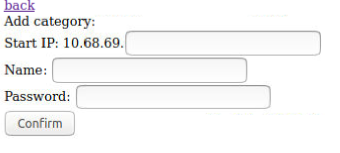

# What is it ?
A software to scan your network, add aliases and configure DHCP and DNS.

### Main page

With important machine down:

With unknown machines:


This page show you all devices.

- The + at the first line is to add a new pool of IP (range of IP with a description)
- Yellow means this machine is found in the arp cache (probably down few minutes ago)
- Blue means this machine is not replying to tcp ping but communicate with arp (probably some sleeping device like alexa or tablet)
- Red means this machine is down
- The name will be clickable if port 80 is open
- Clicking on the MAC will create or edit the dhcp/parameters
- Stability show the number of up/down within 24 hours
- The (i) icon will show you a deep nmap scan
- The + after a mac is to create a new static entry
- The small router icon is when a device is connected through another router

### New pool


### Editor


- Router is DHCP option router
- Name is DNS name
- Important will display an entry in red if it's down
- Router/repeater will consider this host as a router (if the mac of a target is this one, it will show a small router icon with router's name)
- DNS is DHCP dns option
- Web if port 80 is open, to show link in the main page

### History


Warning: a down will appear only if the down is more than 5 minutes

### Scanner

Show you a lot of information about the target

# Install
- Install `docker`
- Copy `env.template` to `.env` and edit the content:
```
IP # public ip of fenping
DEFAULT_GATEWAY # ip of your main router
DHCP_DEFAULT_ROUTER # default router for DHCP
DHCP_DYNAMIC_BEGIN # DHCP scope begin (non reserved)
DHCP_DYNAMIC_END # DHCP scope end (non reserved)
NETWORK # network prefix (always /24)
OTHER_NETWORKS=192.168.0.2/24,192.168.10.2/24 # other public ip that will be routed by fenping
```
- Run `restart.sh`
